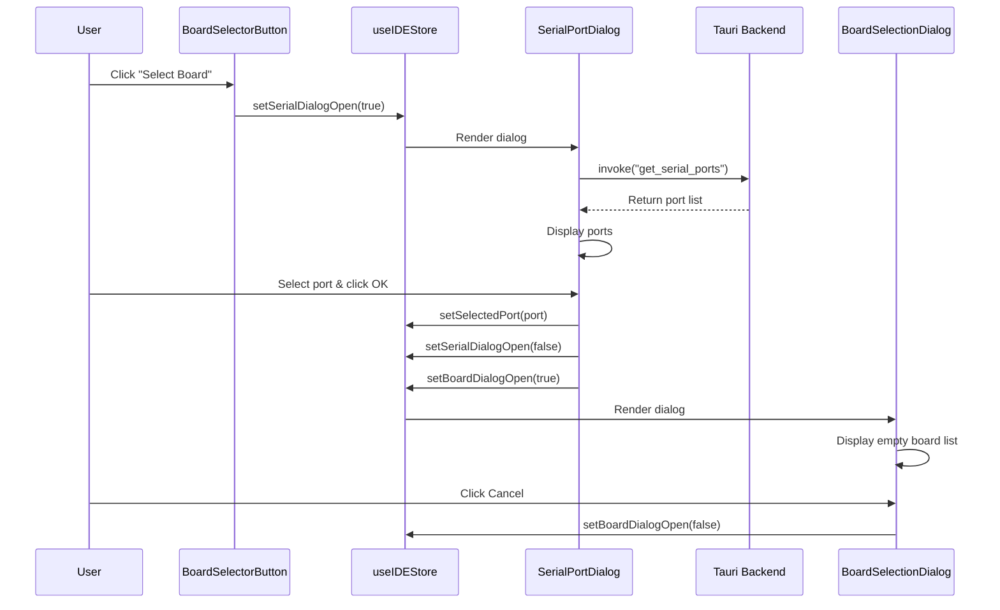
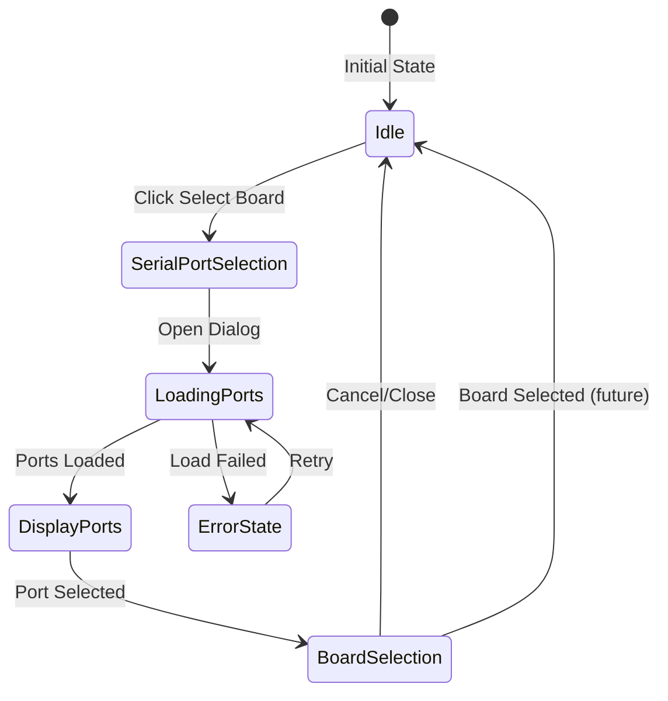

# Design Document: Board Selector

## Overview

O Board Selector implementa o fluxo de seleção de placas no Rusteon IDE, uma aplicação Tauri que combina backend Rust com frontend React/TypeScript. O sistema permite que usuários selecionem uma porta serial e, em seguida, escolham uma placa (embora a lista de placas esteja vazia nesta implementação inicial).

O design segue uma arquitetura em camadas:
- **Frontend (React/TypeScript)**: Componentes de UI para botão, diálogos e interações
- **Estado (Zustand)**: Gerenciamento centralizado do estado da aplicação
- **Backend (Tauri/Rust)**: Comandos para obter portas seriais do sistema operacional

Esta implementação estabelece a fundação para futuras integrações com o Board Manager, que populará a lista de placas disponíveis.

## Architecture

### Component Hierarchy

```
IDELayout
├── Toolbar
│   └── BoardSelectorButton
│       ├── SerialPortDialog (conditional)
│       └── BoardSelectionDialog (conditional)
└── Zustand Store (useIDEStore)
```

### Data Flow



### State Management Flow



## Components and Interfaces

### 1. BoardSelectorButton Component

**Responsabilidade**: Botão na toolbar que inicia o fluxo de seleção de placa.

**Props**: Nenhuma (usa estado global do Zustand)

**Estado Local**: Nenhum

**Interface**:
```typescript
export function BoardSelectorButton(): JSX.Element
```

**Comportamento**:
- Renderiza um botão com ícone de placa e texto "Select Board"
- Ao clicar, chama `setSerialDialogOpen(true)` no store
- Aplica estilos consistentes com a toolbar existente

### 2. SerialPortDialog Component

**Responsabilidade**: Diálogo modal para seleção de porta serial.

**Props**:
```typescript
interface SerialPortDialogProps {
  open: boolean;
  onClose: () => void;
  onPortSelected: (port: string) => void;
}
```

**Estado Local**:
```typescript
interface SerialPortDialogState {
  ports: string[];
  selectedPort: string | null;
  loading: boolean;
  error: string | null;
}
```

**Interface**:
```typescript
export function SerialPortDialog(props: SerialPortDialogProps): JSX.Element
```

**Comportamento**:
- Ao montar, invoca `get_serial_ports` via Tauri
- Exibe spinner durante carregamento
- Renderiza lista de portas disponíveis
- Permite seleção de uma porta (radio buttons ou lista clicável)
- Botão "OK" habilitado apenas quando uma porta está selecionada
- Botão "Cancel" fecha o diálogo sem ação
- Botão "Retry" em caso de erro
- Fecha ao clicar fora ou pressionar Escape

### 3. BoardSelectionDialog Component

**Responsabilidade**: Diálogo modal para seleção de placa.

**Props**:
```typescript
interface BoardSelectionDialogProps {
  open: boolean;
  onClose: () => void;
  onBoardSelected: (board: string) => void;
}
```

**Estado Local**:
```typescript
interface BoardSelectionDialogState {
  boards: string[]; // Sempre vazio nesta implementação
  selectedBoard: string | null;
}
```

**Interface**:
```typescript
export function BoardSelectionDialog(props: BoardSelectionDialogProps): JSX.Element
```

**Comportamento**:
- Renderiza lista vazia de placas
- Exibe mensagem "Nenhuma placa disponível"
- Exibe texto orientativo "Instale placas usando o Board Manager"
- Botão "OK" desabilitado (nenhuma placa para selecionar)
- Botão "Cancel" fecha o diálogo
- Fecha ao clicar fora ou pressionar Escape

### 4. Zustand Store Extension

**Responsabilidade**: Gerenciar estado relacionado ao board selector.

**Interface**:
```typescript
interface BoardSelectorState {
  // Dialog states
  serialDialogOpen: boolean;
  boardDialogOpen: boolean;
  
  // Selected values
  selectedPort: string | null;
  selectedBoard: string | null;
  
  // Actions
  setSerialDialogOpen: (open: boolean) => void;
  setBoardDialogOpen: (open: boolean) => void;
  setSelectedPort: (port: string | null) => void;
  setSelectedBoard: (board: string | null) => void;
}
```

**Integração com useIDEStore existente**:
```typescript
export const useIDEStore = create<EditorState & BoardSelectorState>((set) => ({
  // ... existing state ...
  
  // Board selector state
  serialDialogOpen: false,
  boardDialogOpen: false,
  selectedPort: null,
  selectedBoard: null,
  
  // Board selector actions
  setSerialDialogOpen: (open) => set({ serialDialogOpen: open }),
  setBoardDialogOpen: (open) => set({ boardDialogOpen: open }),
  setSelectedPort: (port) => set({ selectedPort: port }),
  setSelectedBoard: (board) => set({ selectedBoard: board }),
}));
```

### 5. Tauri Backend Command

**Responsabilidade**: Obter lista de portas seriais disponíveis no sistema operacional.

**Interface Rust**:
```rust
#[tauri::command]
async fn get_serial_ports() -> Result<Vec<String>, String>
```

**Retorno**:
- `Ok(Vec<String>)`: Lista de nomes de portas (ex: ["COM3", "COM4"] no Windows, ["/dev/ttyUSB0", "/dev/ttyACM0"] no Linux)
- `Err(String)`: Mensagem de erro em caso de falha

**Implementação**:
- Usa a crate `serialport` para enumerar portas
- Retorna apenas os nomes das portas (não metadados completos)
- Trata erros de permissão ou sistema

**Invocação TypeScript**:
```typescript
import { invoke } from "@tauri-apps/api/core";

const ports = await invoke<string[]>("get_serial_ports");
```

## Data Models

### SerialPort

```typescript
// Simplified model - apenas string com nome da porta
type SerialPort = string;

// Exemplo de valores:
// Windows: "COM3", "COM4", "COM5"
// Linux: "/dev/ttyUSB0", "/dev/ttyACM0"
// macOS: "/dev/cu.usbserial-1420", "/dev/tty.usbserial-1420"
```

### Board

```typescript
// Modelo futuro (não implementado nesta fase)
interface Board {
  id: string;
  name: string;
  platform: string;
  version: string;
}

// Nesta implementação: sempre array vazio
type BoardList = Board[];
```

### Store State

```typescript
interface BoardSelectorStoreState {
  serialDialogOpen: boolean;
  boardDialogOpen: boolean;
  selectedPort: string | null;
  selectedBoard: string | null;
}
```

## Error Handling

### Frontend Error Handling

**Cenário 1: Falha ao obter portas seriais**
- **Causa**: Erro de permissão, driver ausente, ou falha do sistema
- **Tratamento**: 
  - Capturar exceção do `invoke("get_serial_ports")`
  - Exibir mensagem de erro no SerialPortDialog
  - Mostrar botão "Retry" para tentar novamente
  - Permitir fechar o diálogo com "Cancel"

**Cenário 2: Nenhuma porta serial disponível**
- **Causa**: Nenhum dispositivo conectado
- **Tratamento**:
  - Exibir mensagem "Nenhuma porta serial encontrada"
  - Sugerir conectar um dispositivo
  - Mostrar botão "Retry" para atualizar a lista

**Cenário 3: Diálogo fechado inesperadamente**
- **Causa**: Usuário clica fora ou pressiona Escape
- **Tratamento**:
  - Limpar seleções temporárias
  - Resetar estado do diálogo
  - Não modificar `selectedPort` no store

### Backend Error Handling

**Cenário 1: Falha ao enumerar portas**
- **Causa**: Erro do sistema operacional ou permissões
- **Tratamento**:
```rust
#[tauri::command]
async fn get_serial_ports() -> Result<Vec<String>, String> {
    match serialport::available_ports() {
        Ok(ports) => {
            let port_names: Vec<String> = ports
                .iter()
                .map(|p| p.port_name.clone())
                .collect();
            Ok(port_names)
        }
        Err(e) => Err(format!("Erro ao obter portas seriais: {}", e))
    }
}
```

### Error Messages

**Português (idioma padrão)**:
- "Erro ao obter portas seriais"
- "Nenhuma porta serial encontrada"
- "Conecte um dispositivo e tente novamente"
- "Nenhuma placa disponível"
- "Instale placas usando o Board Manager"

## Testing Strategy

### Unit Tests

**Frontend Components**:
1. **BoardSelectorButton**
   - Renderiza corretamente
   - Abre SerialPortDialog ao clicar
   - Aplica estilos corretos

2. **SerialPortDialog**
   - Exibe spinner durante carregamento
   - Renderiza lista de portas corretamente
   - Habilita/desabilita botão OK baseado em seleção
   - Chama onPortSelected com porta correta
   - Exibe mensagem de erro quando falha
   - Exibe mensagem quando lista está vazia
   - Fecha ao clicar em Cancel

3. **BoardSelectionDialog**
   - Renderiza com lista vazia
   - Exibe mensagens informativas corretas
   - Botão OK desabilitado
   - Fecha ao clicar em Cancel

**Zustand Store**:
1. Estado inicial correto (todos null/false)
2. `setSerialDialogOpen` atualiza estado corretamente
3. `setBoardDialogOpen` atualiza estado corretamente
4. `setSelectedPort` armazena porta corretamente
5. `setSelectedBoard` armazena placa corretamente

**Backend Commands**:
1. `get_serial_ports` retorna lista de strings
2. `get_serial_ports` retorna erro quando falha
3. `get_serial_ports` retorna array vazio quando sem portas

### Integration Tests

1. **Fluxo completo de seleção**:
   - Clicar em "Select Board"
   - SerialPortDialog abre
   - Portas são carregadas
   - Selecionar uma porta
   - Clicar em OK
   - BoardSelectionDialog abre
   - Verificar que selectedPort está no store

2. **Fluxo de cancelamento**:
   - Abrir SerialPortDialog
   - Clicar em Cancel
   - Verificar que diálogo fecha
   - Verificar que selectedPort permanece null

3. **Fluxo de erro e retry**:
   - Simular erro ao obter portas
   - Verificar mensagem de erro
   - Clicar em Retry
   - Verificar nova tentativa

### Accessibility Tests

1. Navegação por teclado funciona em ambos diálogos
2. Tab navega entre elementos corretamente
3. Escape fecha diálogos
4. Enter confirma seleção
5. Atributos ARIA presentes e corretos
6. Indicadores de foco visíveis

### Manual Testing Checklist

- [ ] Botão "Select Board" visível na toolbar
- [ ] Clicar abre SerialPortDialog
- [ ] Portas seriais são listadas corretamente
- [ ] Selecionar porta habilita botão OK
- [ ] OK abre BoardSelectionDialog
- [ ] BoardSelectionDialog mostra mensagem de lista vazia
- [ ] Cancel fecha diálogos corretamente
- [ ] Escape fecha diálogos
- [ ] Clicar fora fecha diálogos
- [ ] Estado persiste no Zustand store
- [ ] Erro de portas exibe mensagem e botão Retry
- [ ] Retry funciona corretamente

## Implementation Notes

### Technology Stack

**Frontend**:
- React 19.1.0
- TypeScript 5.8.3
- Zustand 5.0.12 (state management)
- Tailwind CSS 4.2.2 (styling)
- shadcn/ui components (dialog primitives)

**Backend**:
- Rust (edition 2021)
- Tauri 2.x
- serialport crate (para enumerar portas)

### File Structure

```
src/
├── components/
│   ├── BoardSelectorButton.tsx       # Novo
│   ├── SerialPortDialog.tsx          # Novo
│   ├── BoardSelectionDialog.tsx      # Novo
│   └── IDELayout.tsx                 # Modificado (adicionar botão)
├── store/
│   └── useIDEStore.ts                # Modificado (adicionar estado)
└── types/
    └── board-selector.ts             # Novo (tipos compartilhados)

src-tauri/
├── src/
│   └── lib.rs                        # Modificado (adicionar comando)
└── Cargo.toml                        # Modificado (adicionar serialport)
```

### Dependencies to Add

**Cargo.toml**:
```toml
[dependencies]
serialport = "4.5"
```

**package.json**: Nenhuma dependência adicional necessária (shadcn/ui já instalado)

### Styling Guidelines

- Usar classes Tailwind existentes do projeto
- Seguir padrão de cores do IDE (variáveis CSS existentes)
- Diálogos devem ter backdrop escuro semi-transparente
- Botões seguem estilo `.tool-btn` existente
- Listas usam hover states para feedback visual
- Spinners usam animação `.spin-icon` existente

### Accessibility Requirements

- Diálogos devem ter `role="dialog"` e `aria-modal="true"`
- Título do diálogo deve ter `id` referenciado por `aria-labelledby`
- Botões devem ter `aria-label` quando apenas ícone
- Lista de portas deve ser navegável por teclado
- Foco deve ser capturado dentro do diálogo (focus trap)
- Primeiro elemento focável deve receber foco ao abrir

### Future Enhancements

Esta implementação estabelece a base para:
1. **Board Manager Integration**: Popular lista de placas do Board Manager
2. **Port Auto-detection**: Detectar automaticamente a placa conectada
3. **Port Metadata**: Exibir informações adicionais (VID/PID, descrição)
4. **Recent Selections**: Lembrar últimas portas/placas usadas
5. **Favorites**: Permitir marcar placas favoritas
6. **Search/Filter**: Buscar placas por nome ou plataforma

## Design Decisions

### Por que dois diálogos separados?

Separar a seleção de porta e placa em dois diálogos distintos oferece:
- **Clareza**: Cada passo tem propósito claro
- **Flexibilidade**: Futuras features podem modificar um sem afetar o outro
- **UX**: Usuário entende que porta vem antes da placa
- **Manutenibilidade**: Componentes menores e mais focados

### Por que Zustand em vez de Context API?

- **Performance**: Zustand não causa re-renders desnecessários
- **Simplicidade**: API mais simples que Context + useReducer
- **DevTools**: Melhor suporte para debugging
- **Consistência**: Projeto já usa Zustand

### Por que não usar React Query para portas seriais?

- **Simplicidade**: Chamada única, não precisa de cache complexo
- **Controle**: Retry manual é mais apropriado que automático
- **Overhead**: React Query adiciona complexidade desnecessária para este caso

### Por que serialport crate?

- **Padrão**: Crate mais usada para serial ports em Rust
- **Cross-platform**: Funciona em Windows, Linux e macOS
- **Manutenção**: Ativamente mantida
- **Simples**: API direta para enumerar portas

