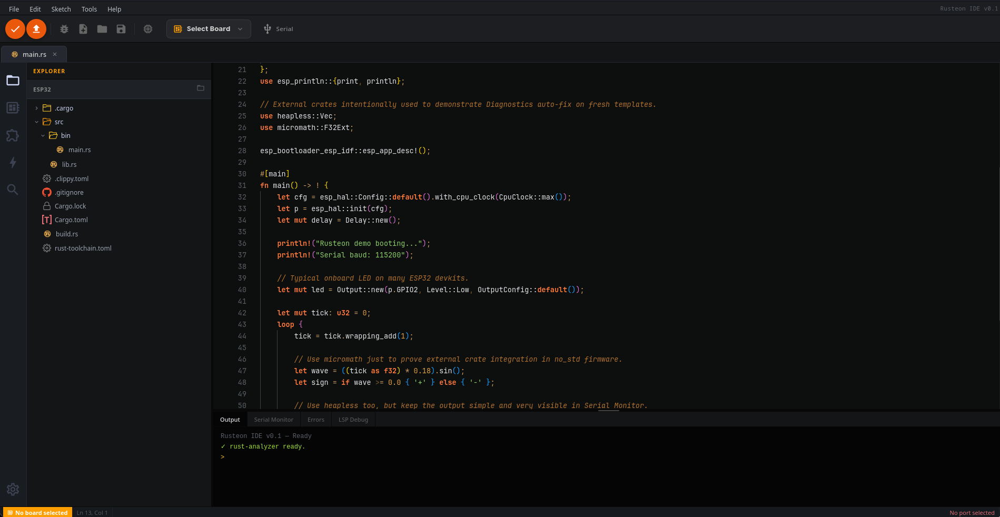

# Rusteon IDE




Rusteon IDE is an "Arduino IDE for Embedded Rust".

The project goal is simple and ambitious: give embedded Rust developers a practical desktop IDE where the full firmware workflow happens in one place, from project creation to flashing and runtime inspection, without forcing users to jump across multiple terminals and tools.

Instead of being "just a code editor", Rusteon is designed around real microcontroller tasks:

- choose board + target toolchain,
- create and open projects,
- manage dependencies and Cargo features,
- build and upload firmware,
- monitor serial logs,
- run debugging sessions with breakpoints,
- inspect RTT logs and language-server diagnostics.

## Why This Project Exists

Embedded Rust is powerful, but onboarding can still be hard. New users usually fight toolchains, targets, Cargo features, linker setup, and debugger flows before they can even blink an LED.

Rusteon IDE exists to reduce that friction.

If Arduino IDE made microcontroller development more accessible in the C/C++ world, Rusteon aims to do the same for Rust embedded development, while keeping advanced capabilities for professional workflows.

## Core Features

### 1) Project Wizard

Create new projects with board-aware defaults and integrated setup flow.

What it does:

- creates new Rust projects,
- integrates with board metadata,
- can install required board target/toolchain directly from the wizard,
- saves and restores your last opened project.

#### Pre-generated Templates (New Project)

When creating a new project, Rusteon can generate a ready-to-use firmware skeleton from curated templates. This is one of the main reasons the IDE feels closer to an "Arduino IDE for Rust": you choose the board + template profile and start coding immediately.

Rusteon currently supports two generation paths:

- `esp-generate` flow for Espressif bare-metal (`esp-hal`) projects.
- `cargo-generate` flow for template repositories (RP2040, STM32, Embassy, ESP-IDF).

Template options available in the wizard:

- **Standard Rust project**
  - basic project scaffold for generic Rust workflows.

- **Espressif / esp-hal (via `esp-generate --headless`)**
  - optimized for no_std embedded Rust on ESP chips.
  - configurable options at generation time:
    - `embassy`
    - `alloc`
    - `wifi`
    - `ble`
    - `esp-backtrace`
    - `log`
    - `defmt`
    - `multicore`
    - `psram`
  - the wizard applies dependency constraints automatically (for example, Wi-Fi/BLE imply additional required options).

- **Espressif / ESP-IDF (via `esp-rs/esp-idf-template`)**
  - std-based ESP-IDF project generation.
  - generated through cargo-generate using MCU-specific parameters.

- **RP2040 official template (`rp-rs/rp2040-project-template`)**
  - includes selectable flash method:
    - `probe-rs`
    - `picotool`
    - `none`
    - `custom`

- **STM32 HAL template (`burrbull/stm32-template`)**
  - configurable chip target (e.g. `stm32f407vg`).
  - configurable HAL source (`last-release` or `git`).
  - optional generation switches:
    - `RTIC`
    - `defmt`
    - `SVD + VS Code task`

- **Embassy template (`lulf/embassy-template`)**
  - async-first embedded setup with configurable chip define.

In practice, this means a new project is not a blank folder: it is a board-aware scaffold with the correct ecosystem starting point, so users can compile and flash faster with fewer manual setup errors.

### 2) Board Manager

Rusteon includes a dedicated Board Manager so users do not need to manually memorize every target string and install command.

Capabilities:

- manage supported boards and architecture profiles,
- detect installed targets,
- install/remove targets via `rustup` or `espup` depending on board,
- keep board state persisted,
- validate target compatibility before build/upload.

The IDE supports common families such as ESP32 (Xtensa and RISC-V variants), RP2040, and STM32 profiles.

### 3) Library Manager (Versions + Features)

This is one of the strongest parts of the project.

The Library Manager lets you work on dependencies and Cargo features visually, without manually editing `Cargo.toml` for every change.

You can:

- add/remove crates,
- choose crate versions,
- inspect feature availability,
- enable/disable Cargo features,
- apply diagnostics-driven fixes when builds fail because of missing features.

This is especially useful in embedded projects, where compile errors are frequently caused by feature mismatches.

### 4) Build + Upload Pipeline

Rusteon runs build and flash commands through the Rust backend and streams output to the IDE in real time.

Highlights:

- project-aware target checks,
- automatic pre-save support,
- serial-port handoff before flashing,
- cancel controls for build/upload,
- resilient process handling in backend.

### 5) Serial Monitor (Integrated)

No external monitor required.

Serial panel features:

- connect/disconnect from selected port,
- baud selection,
- optional timestamps,
- auto-scroll,
- clear/copy actions,
- improved readability for structured runtime lines.

### 6) LSP Integration

Rusteon includes Language Server Protocol integration in the editor workflow.

It supports:

- LSP process lifecycle (start/stop/restart),
- diagnostics,
- hover,
- completion,
- go-to definition,
- LSP debug/log tab in the IDE.

### 7) Debugging (DAP + Breakpoints + RTT)

Rusteon integrates a debug pipeline based on Debug Adapter Protocol and probe-rs style flows.

Current capabilities include:

- build-for-debug flow,
- DAP server session startup,
- breakpoint management in editor gutter,
- active-line tracking while paused/running,
- RTT output handling (e.g. logs routed from debugger output events),
- debug toolbar controls.

This is a key part of the long-term vision: advanced embedded debugging directly in the IDE, without requiring users to manually wire every step in external tooling.

### 8) Diagnostics and Error Surfacing

Rusteon does not stop at showing raw cargo errors.

When failures happen, backend diagnostics can identify common issues (including missing features) and surface them in dedicated UI flows, so fixes can be applied quickly via Library Manager.

### 9) Memory Dashboard Telemetry

The IDE also includes memory telemetry support and a live dashboard for runtime RAM snapshots, useful during firmware tuning.

## Architecture

Rusteon is a desktop app built with:

- **Frontend:** React + TypeScript + Vite + Zustand + MUI
- **Backend:** Rust commands exposed through Tauri v2
- **Bridge:** Tauri invoke/event channels for command execution and log streaming

Main folders:

- `src/` - frontend UI, editor, stores, layout, workflows
- `src-tauri/` - backend commands for project, build/flash, serial, diagnostics, debugger, LSP
- `examples/` - embedded examples

## Installation

### Prerequisites

Install before running Rusteon:

1. Node.js (LTS recommended)
2. Rust toolchain (`rustup`)
3. Tauri system prerequisites for your OS:  
   https://tauri.app/start/prerequisites/

Recommended for embedded workflows:

- `espup`
- `espflash`
- `probe-rs`
- required `rustup target add ...` targets for your boards

### Clone and install

```bash
git clone <your-repo-url>
cd Rusteon-IDE
npm install
```

## Run in Development

```bash
npm run tauri dev
```

This starts the Vite frontend and launches the Tauri desktop app.

## Build for Distribution

```bash
npm run build
npm run tauri build
```

## Typical Developer Workflow in Rusteon

1. Open Project Wizard and create/open a project.
2. Pick your board and confirm target/toolchain in Board Manager.
3. Add libraries and configure versions/features in Library Manager.
4. Build firmware.
5. Upload/flash firmware.
6. Observe runtime via Serial Monitor.
7. Use breakpoints + debug flow when deeper inspection is needed.
8. Use diagnostics + Library Manager to resolve feature/build issues quickly.

## Current Embedded Examples

Included examples:

- `examples/esp32-advanced/01_blocking_led_patterns.rs`
- `examples/esp32-advanced/02_button_led_blocking.rs`
- `examples/esp32-advanced/03_embassy_two_tasks.rs`

## Troubleshooting

### Target not installed

Use Board Manager to install the required target/toolchain profile.  
For ESP32-class boards, ensure your selected board target and project target are compatible.

### Build/Upload cancellation behavior

Cancellation support is integrated in frontend and backend process management.  
If you updated backend code, restart the app (`npm run tauri dev`) to ensure the new cancellation logic is active.

### Serial issues

If serial connection fails:

- confirm selected port is correct,
- close other programs that might lock the device,
- verify OS permissions (especially on Linux).

## Project Vision

Rusteon is being built as a practical daily IDE for embedded Rust teams and solo developers.

At the current stage, development focus is heavily centered on the ESP32 ecosystem. This focus is intentional: ESP32 boards are widely used, offer strong Rust momentum, and are ideal for validating the full end-to-end IDE experience (project generation, board setup, build/flash, serial, and debug).

In the future, the roadmap is to expand and harden support across more microcontroller families, including additional STM32 lines, broader RP-series usage, and other Rust-friendly embedded targets.

The long-term direction is to combine:

- Arduino-like ease of use,
- modern Rust tooling,
- serious embedded debugging (LSP + DAP + RTT + breakpoints),
- and dependency/feature control built for Cargo-first workflows.

In short: a full embedded Rust workstation, not just a text editor.

## Current Status and Roadmap Notes

Rusteon is actively evolving. Some known bugs still exist and are being fixed continuously as the architecture matures.

The project is stable enough for real development workflows, but it is still under active iteration. Users should expect ongoing improvements in areas such as UX polish, process management edge cases, and expanded board/toolchain compatibility.

Several planned features are also still in progress and will be introduced incrementally in upcoming versions. The goal is to keep shipping practical improvements while preserving the "Arduino-like" simplicity for embedded Rust.

## License

MIT © 2026 Cardoso. See `LICENSE` for the full text.
